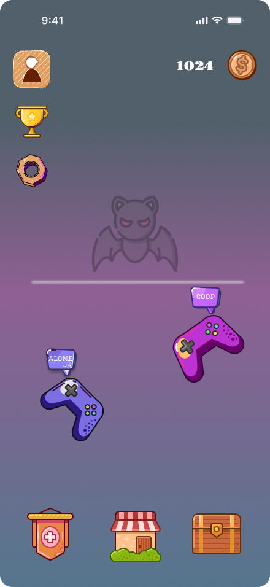
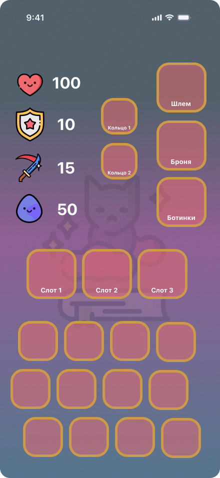
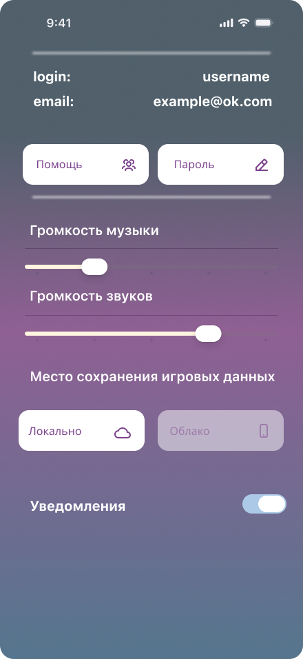
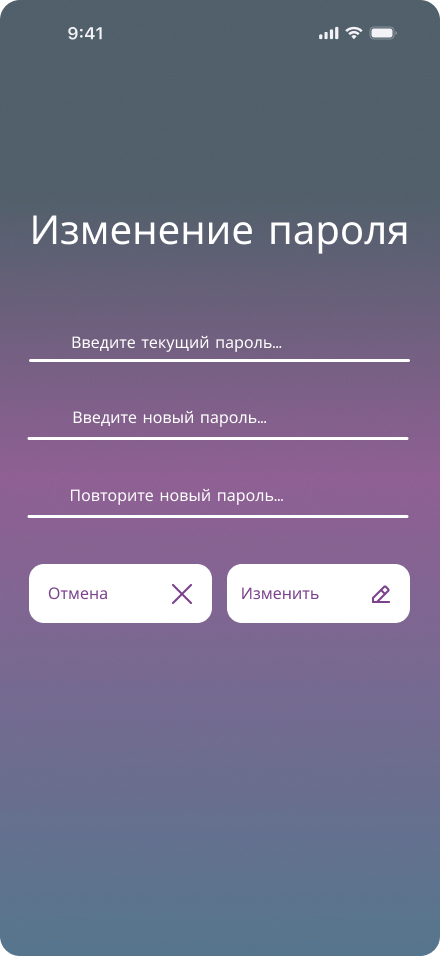
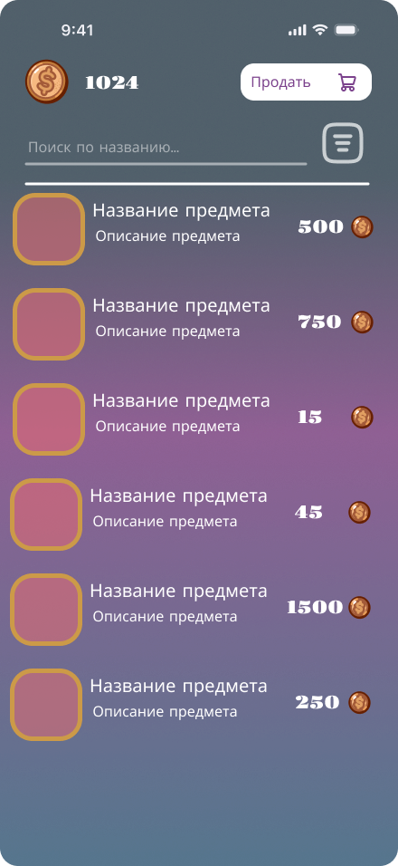

# MobileApp

Мобильное приложение для управления игровым персонажем вне игровой сессии.

## Назначение

Приложение позволяет пользователю управлять состоянием персонажа, просматривать ключевые характеристики, работать с внутриигровыми сущностями и выполнять действия, не связанные с непосредственным игровым процессом.

## Основные возможности

- Просмотр профиля персонажа
- Управление характеристиками и ресурсами
- Работа с инвентарем
- Просмотр прогресса и состояния
- Взаимодействие с серверной частью через API

## Стек

- .NET MAUI
- C#
- ASP NET 10 backend
- PostgreSQL
- REST API

## Структура

- `Views/` — экраны приложения
- `ViewModels/` — логика представления
- `Models/` — модели данных
- `Services/` — доступ к API и инфраструктура
- `Resources/` — стили, изображения, шрифты и прочие ресурсы

## Скриншоты

## Идея проекта

Приложение помогает управлять данными персонажа, следить за прогрессом и выполнять мета-игровые действия с мобильного устройства.
